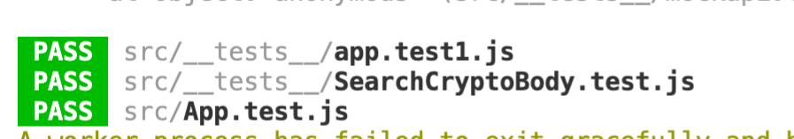

## Cryptolist


CryptoList uses Coingecko API to retrieve data about crypto currencies.
It allows user to search for a crypto currency, see upto 400 crypto currencies,top 7 trending crypto currencies and detailed information about any currency user selects from AllCryptos or Search Cryptos pages.

## Table of contents

- [Description](#Description)
- [Installation](#Installation)
- [Video Link](#Video)
- [Screenshot](#Screenshot)
- [Deployment](#Deployment)
- [API Integration](#API)
- [How to Run](#Run)
- [Testing](#Testing)
- [Contributing](#Contributing)
- [Questions](#Questions)
- [License](#License)

## Description

```md
When I arrive on this app
Then I see a circular loader
When the loading has completed
Then I see list of all cryto currencies
When I see the columns displayed
Then I have Name,Change(24hr),Price,Change%,Volume,VIEW
When I search want to search for a crypto currency
Then I type in the searchbar at the top of the page
When I start to type
Then I get list of all currencies that include the input that I am typing
When I click on ALLCRYPTOS option in the navigation bar
Then I get a paginated list of cryptos
When I count the number of rows
Then I have 10 rows on each page
When I see the number of paginated tabs
Then I get 10 tabs
When I click on the Load Next 100
Then I get a list of next 100 cryptos with pagination
When I have clicked Load Next 100, 3 times
Then the button text is changed to Load from Beginning
When I click on Load from Beginning button
Then First 100 records are loaded again
When I click on TRENDING from the nav bar
Then I see top 7 trending cryptos
When I click on the image or View button
Then I am routed to the crypto currency detail page after the loader is completed
When I see the single crypto page
Then I see the details like market rank,volume, high(24hr),low(24hr)
When I scroll down the single crypto page
Then I see the crypto chart
When I see the crypto chart
Then I see a line graph with price and time coordinated
When I want to change the time duration for the line chart
Then I select from the buttons on the bottom of the chart from 24hr,30days,3 monthe,1 year.
```

## Deployed App Link

https://rajnidua.github.io/Cryptolist/

## Video

(https://drive.google.com/file/d/1aMw43EibaCnoTK0Bvcs3l-OcCfWsm-3F/view?usp=sharing)

## Screenshot

[]

## Screenshot

[]

## Screenshot

[]

## Installation

```md
npx create-react-app cryptolist
```

```md
npm install react-router-dom@5.2.0
```

```md
npm install axios
```

```md
npm install react-loader-spinner --save
```

```md
npm install --save styled-components
```

```md
npm i react-chartjs-2
```

````md
npm i @material-ui/core
``

```md
npm install --save @fortawesome/fontawesome-svg-core
npm install --save @fortawesome/free-solid-svg-icons
npm install --save @fortawesome/react-fontawesome

Import:
import { FontAwesomeIcon } from '@fortawesome/react-fontawesome';
import { faBars } from "@fortawesome/free-solid-svg-icons";
Use:
<FontAwesomeIcon icon={faBars} />
```
````

# API

```md
Coingechko API: https://www.coingecko.com/en/api/documentation
```

## Run

On Localhost : npm start
On gh-pages : npm run deploy

## Deployment

This project is deployed at gh-pages
Link: https://create-react-app.dev/docs/deployment/#github-pages

Steps:

```md
git status
git add -A
git commit -m "changes"
git push origin main
npm run deploy
```

## Testing

jest for unit testing
[]

## Contributing

Rajni Dua

## Questions

For any further questions, reachout to me at :

- Github: [rajnidua](https://github.com/rajnidua)
- Email: rajni.dua14@gmail.com

## License


&copy; 2021 Rajni Dua

_Licensed under [MIT](./license)_
